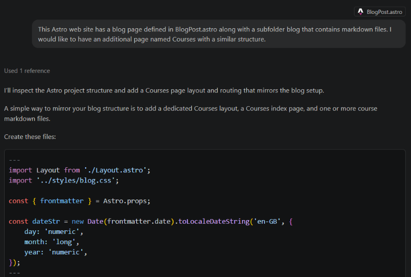
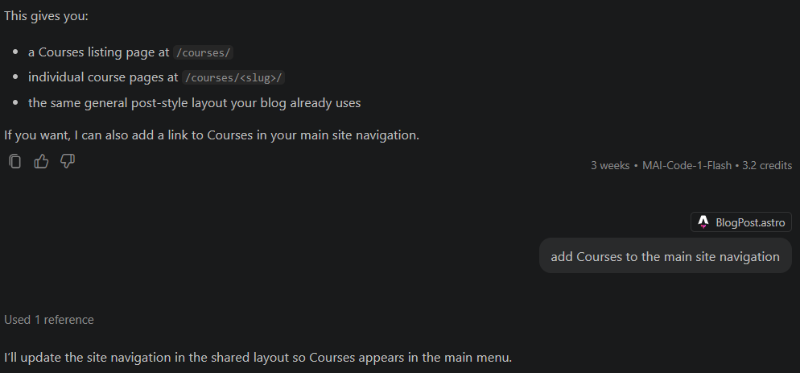
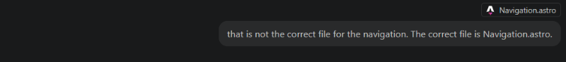
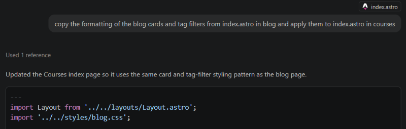
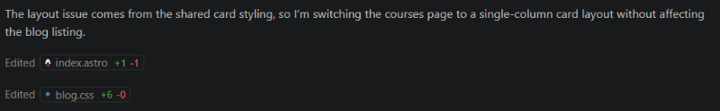
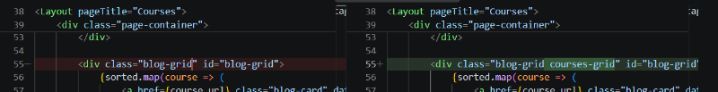
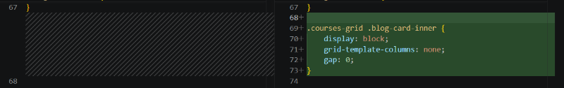

I've been creating my website by using Astro, which creates a set of static web pages rather than a dynamic content management system like Wordpress. Astro is a framework for building the web site, but doesn't provide a user interface for editing. I am editing the content by using Visual Studio Code. Using Visual Studio Code gives me easy integration with GitHub and automated deployment to GitHub pages.

For the web site, I'm using a template developed by someone else. I ran through the tutorial on the Astro web site and have a basic understanding of how it works. However, I'm far from a professsional developer. I'm pretty sure I can slog through making updates to layout and such, but Visual Studio Code has AI integration that helped significantly. I do not have a subscription. This is a free function in the tool. However, there are paid options for various AI models.

In the past, I've done plenty of bits and pieces of scripts where I make a request in ChatGPT or other AI and get the whole script or code snippet returned. The real benefit I saw with integration in Visual Studio Code was giving AI access to all of the project files. This provides AI with the context to make good suggestions. The more AI sees, the better.

The right side of Visual Studio Code has a Chat pane that you can use to make requests to AI. The following is a chat from when I was setting up the site. I truncated the output for easier reading.

When it made a mistake, I pointed it in the right direction to get it correct.

Later on when I was editing existing pages, it showed me side-by-side what it wanted to do based on my request. This let me validate changes before they were made.

The following was particularly useful because I'm not well versed in cascading style sheets for formatting.

