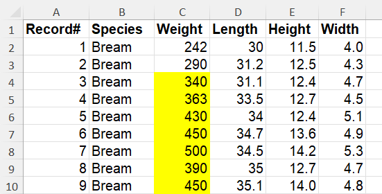
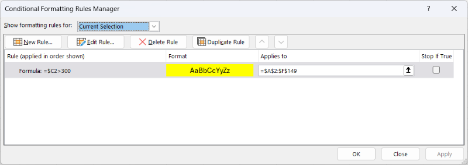
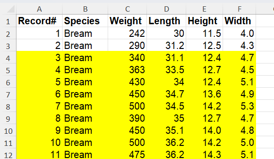

*Originally posted for students Nov 2025.

Here is a quick conditional formatting example that shows how to format individual cells vs formatting a whole row. The difference is in the **Applies to** area.

When you format individual cells in a column, this is what the rule looks like:

The formula is **=$C2>300**. This allows the row to change as we do evaluation but we stay locked on the **C** column.

The formula applies from **$C$2:$C$149**. This means that we'll perform the formatting only on these cells in column **C**. Our data has headers in row **1** that we don't want to evaluate.

Overall what happens is that every cell from **C2** down to **C149** is evaluated and if that cell is greater than **300**, the cell is formatted.

If we used a reference in the formula with both **$** like **$C$2** or **$C$4** then only that individual cell would be evaluated and the entire applies to area would be formatted based on the value in that one cell. If the formula were **=$C$2>300** then all cells **C2:C149** would not be formatted because **C2** is not greater than **300**. If the formula were **=$C$4>300** then all cells **C2:C149** would be formatted because **C4** is greater than **300**.

This is the result of the rule above:

When you format a whole row, this is what the rule looks like:

Notice that the only change in the rule is the **Applies to** section. This now includes the columns from **A** to **F** instead of just column **C**.

Overall what happens is that every cell from **C2** down to **C149** is evaluated and if that cell is greater than **300**, the cells from columns **A** to **F** in that row are formatted.

This is the result of the rule above:

