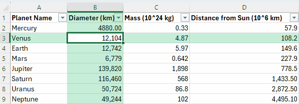

*Originally posted for students in Nov 2025

Today a student and I accidentally learned about a new feature in Excel.

Focus Cell highlights the row and column of the cell you have selected. This makes it easier to view large sets of data. This feature was released in Dec 2024. Before this feature, you could create the functionality with a macro, but macro-enabling every workbook is not cool.

Enable **Focus Cell** from the **View** tab.

Graphic taken from Microsoft documentation at: [Focus Cell is now generally available everywhere | Microsoft Community Hub](https://techcommunity.microsoft.com/blog/excelblog/focus-cell-is-now-generally-available-everywhere/4303454)
