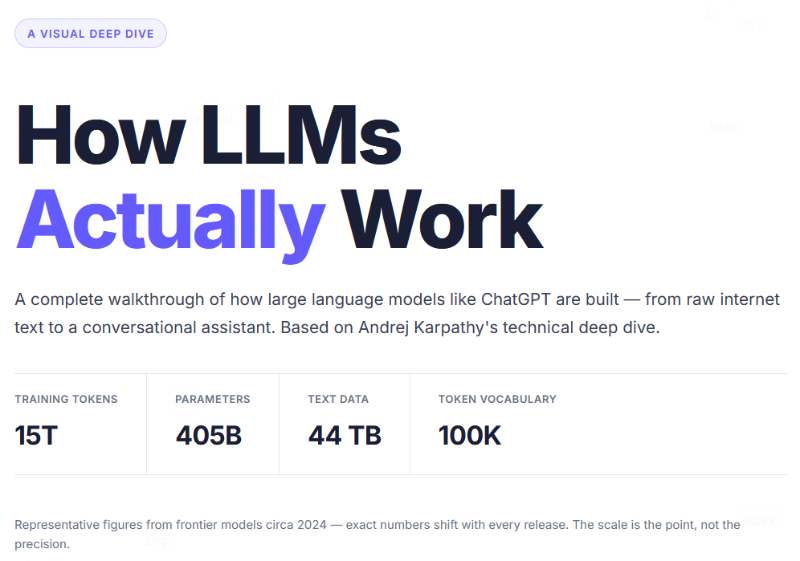

In Fall of 2025 a student showed me this web site about LLM functionality. If you're interested in some of the technical details, this web site does a good job of explaining it in a way that relatively easy to understand.

[https://ynarwal.github.io/how-llms-work/index.html](https://ynarwal.github.io/how-llms-work/index.html)