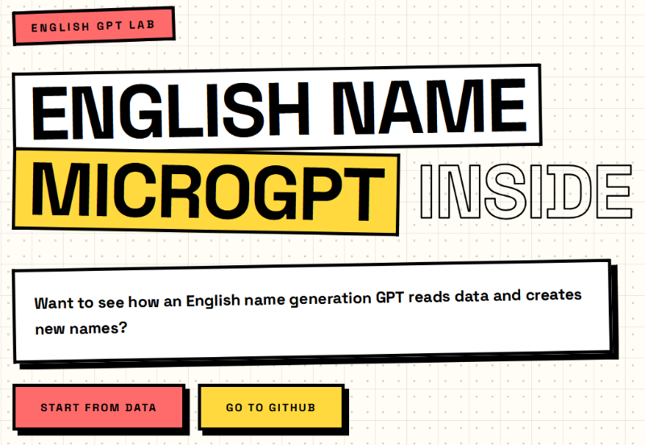

*Sent to me by Bryce Koop a student in my class.

This web site describes and demonstrates a simplified version of how LLMs use token prediction to generate a response. An LLM breaks words down into chunks called tokens. This simplified example, breaks english names down into individual letters, and the individual letters are the tokens.

A bunch of numbers are involved in this process, but it's not necessary to understand the details of the math to get a general understating of the process. You can see how training data is broken down, collected, and organized. Then, how that collected training data is used to generate names by predicting which individual letters should follow the previous based on probability.

To work through the example, on the web page, click **START FROM DATA**.

[https://ko-microgpt.vercel.app/](https://ko-microgpt.vercel.app/)
