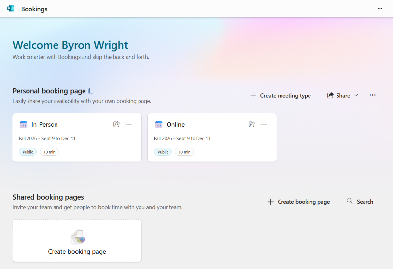
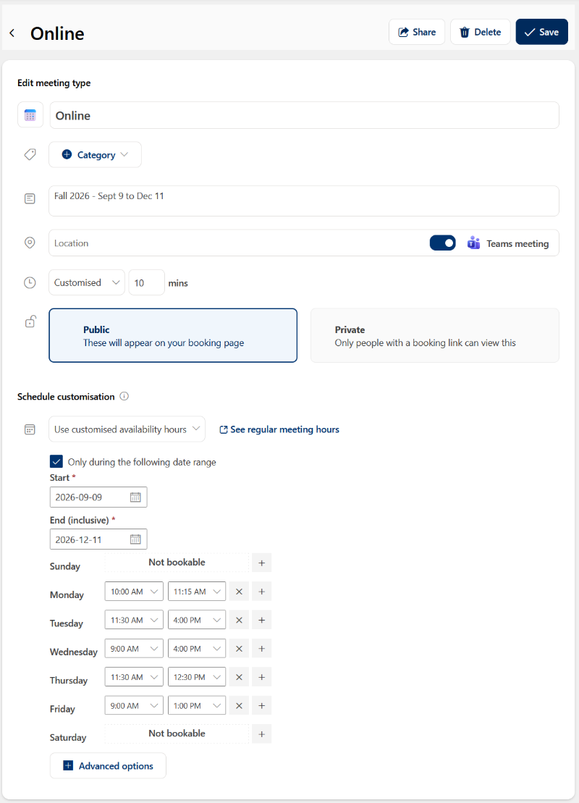
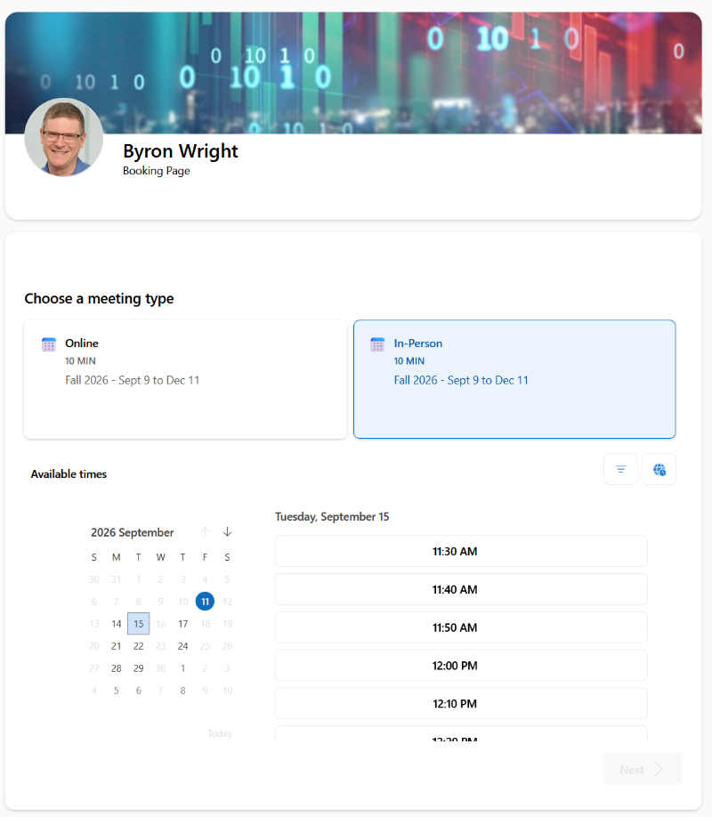

Traditional office hours are 2 to 3 times per week for periods of 1 to 2 hours. This is limited availability to communicate with students. Even when office hours are scheduled and available students are not good at keeping track of availability and worry you won’t be there.

Communication patterns have changed and much student interaction is done by email. However, there are still times direct conversations are better. Whether those conversations are in-person or an online meeting.

To enhance my availability, simplify communication, and increase student engagement, I am using the Microsoft Bookings app that is included as part of our Microsoft 365.

It has the following features:

- **Set a schedule for in-person meetings**. This is set to be only my scheduled office hours.
- **Set a schedule for meetings in Microsoft Teams**. I give this wide availability outside of my typical office hours.
- **Students book time via a web page**. I publish the link for students to book times with me in both UM Learn and as part of my email signature.
- **Integration with Outlook calendar**. When students book a meeting, it is automatically added to my Outlook calendar. If I have another meeting in my calendar, then that time is unavailable for students when they do the booking as long it shows my status as Busy in that time.

The figure below shows the user interface where I create booking types and define their schedules. At different times such as during exams or during the regular term I update my availability. The schedule can vary by day of the week.

The figure below shows the options when you configure a meeting type.

The figure below shows the student view when they are booking a meeting. They can select the booking type and time. A calendar shows date and time availability.

Microsoft documentation: [https://learn.microsoft.com/en-us/microsoft-365/bookings/?view=o365-worldwide](https://learn.microsoft.com/en-us/microsoft-365/bookings/?view=o365-worldwide)
