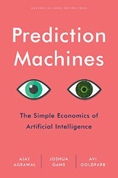

Before AI became all the rage with large language models (LLMs) we had self-driving cars and AI being integrated into other applications like invoice processing. How much we talk about AI has changed, but under the hood it's still a big ball of math trying to make predictions based on patterns.

I read this book back in 2020 before LLMs were the big thing but I still think it's relevant today for general understanding.

My review from 2020:

> This is a great business-level book that discusses AI. Reading this book I had a real lightbulb moment when there was a discussion of separating judgement from prediction of outcomes in decision making. When AI wasn't making the judgement and was just a tool in the decision making process I saw clearly how it could be used in many instances. There's a lot more to the book including how it might affect employment, different strategies that business might use, the value of data for learning (and how the value of historical data drops once the learning is done).

> This book does not discuss AI at a technical level. I found it quite accessible as someone with an interest in technology.

The authors are professors at the University of Toronto Rotman School of Management.

They have a followup book ***Power and Prediction: The Distruptive Economics of Artificial Intelligence***, but I haven't gotten around to reading that one.
