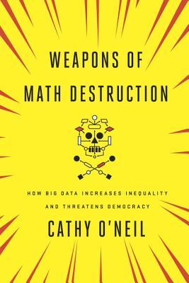

**How Big Data Increases Inequality and Threatens Democracy**

Before artificial intelligence became the big concern, big data was giving companies and governments the ability to spot patterns and make predictions. If you're interested in the practical applications of how big data might affect your life and the life of others, give this book a read. It provides practical examples of how models developed from big data that make sense for companies from a profit perspective do not have a positive impact on society. The conclusion provides some examples of how models can have a beneficial impact when they are applied properly.

Cathy O'Neil has give many presentations on Weapons of Math Destruction. Many of them are available on YouTube. If you never read the book, consider watching one of the presentations.

Here is a relatively short TED Talk (13 minutes):

- The era of blind fail in big data must end | Cathy O'Neil  
[https://youtu.be/_2u_eHHzRto?si=fR7RurHpcdthNIQS](https://youtu.be/_2u_eHHzRto?si=fR7RurHpcdthNIQS)
